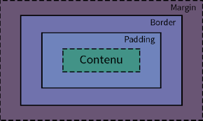

## Rappels

- C'est le W3C (World Wide Web Consortium) qui gère les évolutions du HTML/CSS.
- Un CTA, est un "Call To Action" : c'est à dire un lien ou un bouton qui déclenche une action.
- Un CDN (Content Delivery Network) est un système permettant de livrer rapidement des ressources web (css, js, vidéos, etc...)
- Le HTML est basé sur le XML, qui est un langage de balisage structurant.
- Une maquette est le design du site internet réalisé par un graphiste sous forme d'image.
- **Figma** : C'est un logiciel de graphisme, qui est parmi les plus utilisés pour réagliser des maquettes.

### Modèle de boite



Cela concerne tous les blocs (= élément HTML). Chacun dispose de 4 parties qui le composent : 

1. `content` : le contenu du bloc
2. `padding` : la marge intérieure du bloc
3. `border` : la bordure du bloc
4. `margin` : la marge extérieure du bloc

Lorsque l'on découpe "visuellement" une maquette, on suit l'ordre suivant : 
1. Définir l'emplacement de la bordure, s'il y en avait une (elle n'est pas forcément visible)
2. Déterminer l'emplacement du contenu
3. Vérifier les margins
4. Vérifier les paddings

*Note* : Les margins et les paddings sont presque tout le temps égaux à l'opposé, pour respecter une symétrie.

### RWD (Responsive Web Design)

Le principe est que le contenu s'adapte parfaitement à toutes les tailles d'écran. 

Pour le faire, on utilise des BreakPoints, appelées "Media Queries" en CSS. Le principe, est de définir une largeur en pixels,
et d'adapter le contenu de la page, en fonction de sa largeur. En gros, vous appliquer certaines règles CSS en fonction de la
largeur de votre écran.

Voici un exemple de création de 2 `breakpoints` : 

```css
/* Code qui s'exécute sur toutes les tailles d'écran */
.left, .right {width: 50%; height: 580px;}

/* Code pour tous les écrans inférieurs à 980px */
@media screen and (max-width: 980px) {
    /* On force le passage à la ligne */
    .test {flex-wrap: wrap;}
    /* On redéfini la largeur des blocs à 100% */
    .left, .right {width: 100%;}
}

/* Code pour tous les écrans inférieurs à 460px */
@media screen and (max-width: 460px) {
    /* On redéfinit la hauteur des blocs pour qu'elle soit moins importante */
    .left, .right {height: 290px;}
}
```

### Display

Le display est une propriété CSS qui permet de gérer la manière dont les éléments doivent être affichés.

Il en existe 6 principaux : 
- `None` : N'affiche pas l'élément
- `Block` : Prend 100% de la largeur disponible. S'adapte en hauteur, en prenant le minimum nécessaire pour afficher le contenu. On peut redéfinir sa taille en dur.
- `Inline` : Prend uniquement l'espace nécessaire en hauter et en largeur pour afficher son contenu. On ne peut pas redéfinir sa taille.
- `Inline-Block` : C'est le même comportement que "Inline", à ceci près qu'on peut modifier sa tailler et son padding.
- `Flex` : cf : <a href="https://css-tricks.com/snippets/css/a-guide-to-flexbox/" target="_blank">CSS Tricks</a>
- `Grid` : respecte le principe d'une grille.

Source pour s'entraîner au display flex : <a href="https://flexboxfroggy.com/#fr" target="_blank">Flexbox Froggy</a>

### Les polices d'icônes

Lorsqu’on utilise beaucoup d’icônes sur un site, il est souvent plus efficace d’utiliser une police d’icônes plutôt que d’importer des dizaines d’images SVG ou PNG.
Le principe : les icônes sont regroupées dans une police, et chaque icône est un « caractère » que l’on affiche via une classe CSS.

Exemple d'utilisation de Font Awesome (<a href="https://fontawesome.com/">lien du site ici</a>) : 

```html 
<i class="fa-solid fa-user"></i>
```

Il est aussi possible de copier/coller directement un SVG au format XML. Par exemple : 

```html
<svg xmlns="http://www.w3.org/2000/svg" viewBox="0 0 640 640"><!--!Font Awesome Free v7.1.0 by @fontawesome - https://fontawesome.com License - https://fontawesome.com/license/free Copyright 2025 Fonticons, Inc.--><path d="M320 312C386.3 312 440 258.3 440 192C440 125.7 386.3 72 320 72C253.7 72 200 125.7 200 192C200 258.3 253.7 312 320 312zM290.3 368C191.8 368 112 447.8 112 546.3C112 562.7 125.3 576 141.7 576L498.3 576C514.7 576 528 562.7 528 546.3C528 447.8 448.2 368 349.7 368L290.3 368z"/></svg>
```

Pour modifier les couleurs d'un SVG, il faut utiliser les propriété suivantes : 

```css
svg {
    /* fill permet de définir la couleur de remplissage */
    fill: red;
    /* stroke permet de définir la couleur des bordures */
    stroke: green;
    /* stroke-width permet de définir la largeur des bordures */
    stroke-width: 10px;
}
```


## Bootstrap

Bootstrap est un framework (cadre de travail) qui vous fourni un code CSS déjà prêt à l'emploi.

<a href="https://getbootstrap.com/docs/5.3/getting-started/introduction/" title="Lien de la doc de bootstrap" target="_blank">Lien de la doc de bootstrap</a>

### La Grid Bootstrap

#### Les bases

Bootstrap est prévu pour fonctionné sur un modèle de 12 colonnes découpables. Ces colonnes s'utilisent grâce aux classes suivantes : 
- `col-1` : Prend l'espace de 1 colonne dans le bloc parent.
- `col-2` : Prend l'espace de 2 colonnes dans le bloc parent.
- `col-3` : Prend l'espace de 3 colonnes dans le bloc parent.
- `col-4` : Prend l'espace de 4 colonnes dans le bloc parent.
- `col-5` : Prend l'espace de 5 colonnes dans le bloc parent.
- `col-6` : Prend l'espace de 6 colonnes dans le bloc parent.
- `col-7` : Prend l'espace de 7 colonnes dans le bloc parent.
- `col-8` : Prend l'espace de 8 colonnes dans le bloc parent.
- `col-9` : Prend l'espace de 9 colonnes dans le bloc parent.
- `col-10` : Prend l'espace de 10 colonnes dans le bloc parent.
- `col-11` : Prend l'espace de 11 colonnes dans le bloc parent.
- `col-12` : Prend l'espace de 12 colonnes dans le bloc parent.


Chaque colonne doit **Obligatoirement** être disposée dans un autre élément qui dispose de la classe `.row`

```HTML
<!-- 1 ligne -->
<div class="row">
    <!-- qui prend tout l'espace -->
    <div class="col-12">
    </div>
</div>
<!-- 1 ligne -->
<div class="row">
    <!-- qui prend 50% de l'espace -->
    <div class="col-6">
    </div>
    <!-- qui prend 50% de l'espace -->
    <div class="col-6">
    </div>
</div>
```

Dernière spécificité, tous les `row` doivent être dans un élément contenant la class `container` ou `container-fluid`.

le `container` laisse des marges droite / gauche de visibles tandis que le `container-fluid` prend 100% de la largeur.

#### Le Responsive (RWD)

Bootstrap inclu ses propres breakpoints (<a href="https://getbootstrap.com/docs/5.3/layout/breakpoints/#available-breakpoints" target="_blank">breakpoints bootstrap</a>) que voici : 

| Breakpoint            | Class infix | Dimensions |
|-----------------------|-------------|------------|
| Extra small           | None        | <576px     |
| Small                 | sm          | ≥576px     |
| Medium                | md          | ≥768px     |
| Large                 | lg          | ≥992px     |
| Extra large           | xl          | ≥1200px    |
| Extra extra large     | xxl         | ≥1400px    |

Ce qui signifie que pour les colonnes, vous pouvez préciser :

- `col-6` : Prend 6 colonnes sur 12 dans le bloc parent.
- `col-sm-6` : Prend 6 colonnes sur 12 à partir du breakpoint small.
- `col-md-6` : Prend 6 colonnes sur 12 à partir du breakpoint medium.
- `col-lg-6` : Prend 6 colonnes sur 12 à partir du breakpoint large.
- `col-xl-6` : Prend 6 colonnes sur 12 à partir du breakpoint extra large.
- `col-xxl-6` : Prend 6 colonnes sur 12 à partir du breakpoint extra extra large.

### Customisation
lorsque l'on souhaite faire des modifications sur Bootstrap, la bonne manière, est surtout de ne jamais toucher au fichier de base de bootstrap.
A la place, il faut créer un fichier de CSS sur mesure (custom) et le positionner à la fin de la balise `<head>` pour le charger.
Créez ensuite vos propres classes, en vérifiant qu'elles n'existent pas déjà dans bootstrap, puis mettez en place le nécessaire.
